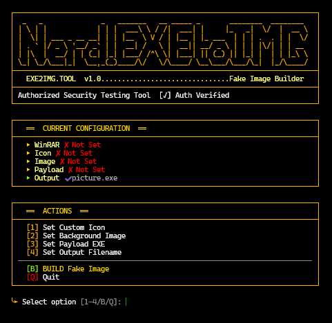

# EXE2IMG.TOOL - Fake Image Builder

---

## Overview

**EXE2IMG** is a professional-grade social engineering payload wrapper that disguises malicious or testing executables as innocent-looking image files. It uses WinRAR SFX (Self-Extracting Executable) technology to create a single `.exe` file that displays a chosen image while silently executing a payload in the background.

This tool is designed exclusively for **authorized penetration testers** and red team operators to simulate realistic malware delivery techniques during security assessments.

---

## Features

- **Visual Disguise**: Displays a real image when the executable is double-clicked
- **Silent Payload Execution**: Runs any `.exe` payload in the background without user interaction
- **Custom Icon Support**: Apply any `.ico` file to further enhance realism
- **SFX-Based Architecture**: Built using WinRAR's reliable self-extracting module
- **Clean Output**: Produces a single compact executable
- **User-Friendly Terminal Interface**: Beautiful ASCII interface with live configuration status
- **Cross-Platform Compatibility**: Works on Windows (requires WinRAR installed)

---

## Quick Start

```bash
# Python 3.6+ required
python nerdexetoimg.py
```

The tool will guide you through a clean terminal menu:

```
  ┌──────────────────────────────────────────────────────────┐
  │  ══  ACTIONS  ══                                         │
  ├──────────────────────────────────────────────────────────┤
  │  [1] Set Custom Icon                                     │
  │  [2] Set Background Image                                │
  │  [3] Set Payload EXE                                     │
  │  [4] Set Output Filename                                 │
  ├──────────────────────────────────────────────────────────┤
  │  [B] BUILD Fake Image                                    │
  │  [Q] Quit                                                │
  └──────────────────────────────────────────────────────────┘
```

---

## Configuration Options

| Option | Description | Required |
|--------|-------------|----------|
| **Background Image** | JPG or PNG that will be shown to the victim | Yes |
| **Payload EXE** | The executable that will run silently | Yes |
| **Custom Icon** | `.ico` file for the final executable (optional) | No |
| **Output Name** | Final filename (e.g. `vacation_photo.exe`) | Yes (default: `picture.exe`) |

---

## How It Works

1. The tool bundles your chosen **image** and **payload** into a WinRAR SFX archive
2. Configures the SFX to:
   - Extract files to `%TEMP%`
   - Display the image (`photo.jpg`)
   - Automatically run the payload executable
3. Applies custom icon if provided
4. Produces a final `.exe` that behaves like a normal image file

**Victim Experience**:
- Double-clicks → Image opens normally
- Payload executes silently in the background

---

## Requirements

- **Windows Operating System**
- **WinRAR** installed (WinRAR.exe must be detectable)
- **Python 3.6+**
- No external Python dependencies (uses only standard library)

---

## Usage Recommendations

### Best Practices
- Use realistic image names (`family_photo.jpg`, `invoice_scan.png`, `screenshot.png`)
- Choose believable icons (PDF, Word, or image file icons)
- Test the final executable before deployment
- Keep payload size reasonable for better social engineering success

### Testing Workflow
1. Set a harmless test payload first (e.g., `msgbox.exe`)
2. Verify the image displays correctly
3. Replace with real payload for engagement

---

## Known Limitations

- Requires **WinRAR** to be installed on the build machine
- Generated executables may be flagged by some antivirus solutions (as expected for any SFX packer)
- Only works on Windows targets
- Icon changing may not work perfectly with all custom `.ico` files

---

## Legal & Authorization

This tool is provided for **authorized security assessment purposes only**. 

**Authorized use cases include:**
- Red team engagements
- Social engineering simulations
- Malware delivery technique testing
- Security awareness training